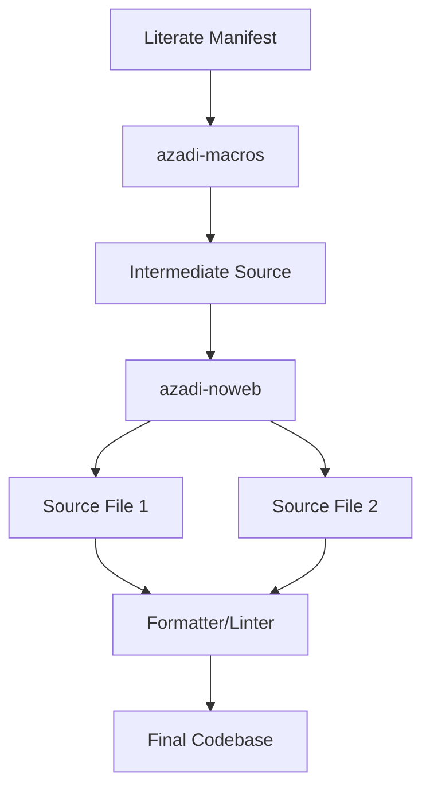

# Azadi: Literate Architecture Reference

This document outlines the standard architecture for the **Azadi** literate programming system, focused on building maintainable and documentation-rich software.

## Transformation Pipeline

The system uses a **Two-Pass Transformation Pipeline** to turn high-level literate manifests into optimized, production-ready source code.

## Core Architectural Concepts

### 1. Unified Source of Truth
The literate manifest is the primary source of truth. By defining macros that generate code across multiple files, you ensure that related changes are always synchronized.

### 2. Build-System Synchronization
The transformation pipeline is designed to be an atomic step managed by the project's build system (e.g., Ninja, Make, Meson). This ensures:
-   **Parallel Safety**: Only one transformation process runs at a time.
-   **Incremental Correctness**: Changes in the manifest correctly trigger a re-generation and re-compilation of all dependent binaries.

### 3. Delimiter Isolation
To prevent collisions between literate markup and the target programming language, Azadi allows full customization of delimiters. Choosing project-specific delimiters (e.g., `<[` and `]>`) ensures the extraction process is robust against standard language syntax.

---
*Maintained by the Azadi Development Team.*
